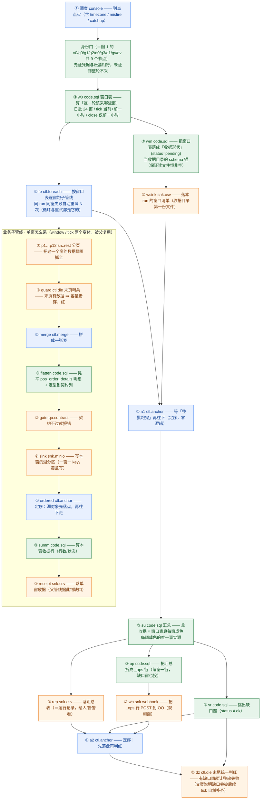

```mermaid
flowchart TD
  S["① 调度 console —— 到点点火（补跑语义由 misfire / catchup 定）"]:::e1
  S --> W0["② w0 src.rest 身份探针 —— 先问网关「我是谁」<br/>拿回凭据对应的账套号与可见门店（先证后采第一步）"]:::e2
  W0 --> G0["③ g0/g1/g2 code.sql —— 把身份从响应里挖出来<br/>抠 data: 行 → 取最后一条 → 剥外壳 → 得账套 + 门店清单"]:::e3
  G0 --> D0["② d0 ctl.die 反向闸 —— 抠不出身份就红<br/>挡住网关形状漂移后的「静默采错账套」"]:::e2
  D0 --> G3["③ g3 code.sql 两条断言 —— 凭据账套 == 配置账套？<br/>配置门店 ⊆ 可见门店？越权就列出来"]:::e3
  G3 --> D1["② d1 ctl.die —— 有违规行即红，并阻断下游<br/>身份未证时一次业务调用都不发（先证后采）"]:::e2
  D1 --> GV["③ gv code.sql 形状闸 —— 期望值（批号/账套/快照/页数）形状合法吗<br/>防「env 缺参 ⇒ 断言静默半失效」"]:::e3
  GV --> DV["② dv ctl.die —— 形状不合就红（缺席/畸形一律拒采）"]:::e2
  DV --> P["② p1…pN src.rest 分页 —— 一页一请求把数据抓回来<br/>页数×页容量就是这台网关的容量上限"]:::e2
  P --> GUARD["② guard ctl.die 末页哨兵 —— 最后一页还有数据 ⇒ 容量击穿<br/>立刻红（fail-loud，不静默丢数）"]:::e2
  GUARD --> MG["① merge ctl.merge —— 把 N 页拼成一张表（零逻辑）"]:::e1
  MG --> SH["③ shape code.sql 定型 —— 注入 batch_id / system_book / snapshot<br/>并把列名与类型钉死（落湖即定型）"]:::e3
  SH --> GT["② gate qa.contract 契约闸 —— 必要列非空才算过<br/>不过就直接报错，不写湖"]:::e2
  GT --> SK["② sink snk.minio 写湖 —— 按分区路径落 parquet<br/>单对象覆盖 ⇒ 同批重跑逐字节一致（幂等）"]:::e2
  classDef e1 fill:#e8f0fe,stroke:#4285f4,color:#0b3d91
  classDef e2 fill:#fff4e5,stroke:#e8710a,color:#7a3300
  classDef e3 fill:#e6f4ea,stroke:#137333,color:#0d5221
```

# 乐檬（lemeng）采集管线流程图

> **这是「源系统 = 乐檬」的图。** 两个账套（3120 / 64188）**共用同一批管线** —— 客户差异只在
> `env`（账户号 / 门店清单 / 桶）· 保存的连接 · 每账套一份的排班文件 ⇒ **下面两张图对两个账套都成立**，
> 客户既不进图、也不进文件名。
> **图例与通用表**（🟦 引擎替我们干的 / 🟧 语义由我们写）在 [`README.md`](README.md)；
> **形态与选型的正典**在 `docs/data-platform-handbook.md` §1.1.7；**乐檬特有的方言**在各管线自己的
> `_note` 与 handbook §1.6 案例库。**本文件不复制正文。**
> **维护约定**：改了乐檬任何管线的节点/边 ⇒ 改本图，并重跑 `pnpm exec tsx scripts/lemeng/data-plane-lock.mjs`。

## 乐檬的三形态 × 8 条管线

| 形态 | 文件 | 份数 |
|---|---|---|
| **L0 直连**（单窗/日频，无跨窗编排） | `lemeng.dim.branch.l0.json` · `lemeng.dim.item.l0.json` | 各 1（双账套） |
| **L1 编排**（跨窗循环） | `lemeng.retail.windows.l1.json` · `lemeng.retail.tick.l1.json` · `lemeng.retail.close.l1.json` | 3 |
| **业务子管线**（单窗怎么采，被 L1 复用） | `lemeng.retail_order_line.window.json` · `lemeng.retail_order_line.tick.json` | 2 |
| **回填变体**（只差窗口来源，不进调度） | `lemeng.retail.windows.backfill.json` | 1 |

---

## 图 1 · L0 直连（维度面：全量快照）

> 档：**①** 纯 duckle · **②** duckle 组件 + 我们的规则/配置 · **③** 纯手写代码（`code.sql`）
> 每个节点标注 = **档 + 节点 + 组件 + 这个节点干什么**。

| 节点 | 档 | 组件的（引擎给的机制） | 我们的（我们写的内容） |
|---|---|---|---|
| `w0` src.rest | ② | REST 请求 · 重试 · SSE 原件落盘 | 探针请求体 · `data.schema` · raw 落**绝对路径**（不写对象存储） |
| `g0` / `g1` / `g2` | ③ | SQL 执行壳 | 抠 `data:` 行 → 取最后一条 → 剥 JSON-RPC 外壳 → 取出 `company_id` / 门店清单 |
| `d0` ctl.die | ② | 无行即红 | 判据：抠不出身份就红 |
| `g3` | ③ | SQL 执行壳 | 两条断言：账套相符 · 配置门店 ⊆ 可见门店 |
| `d1` ctl.die | ② | 有违规即红 + **阻断下游** | 违规即拒采（先证后采） |
| `gv` | ③ | SQL 执行壳 | 期望值形状（批号 / 账套 / 快照 / 页数） |
| `dv` ctl.die | ② | 有违规即红 | —（判据就是 `gv` 的形状） |
| `p1…pN` src.rest | ② | 分页抓取 · 重试 · 每页落盘 | 页数 / 页容量（阈值 = (页数−1) × 页容量）· 游标形状 |
| `guard` ctl.die | ② | 命中即红 | 容量截断判据（末页非空 ⇒ 击穿） |
| `merge` ctl.merge | ① | 合并多页 | — |
| `shape` | ③ | SQL 执行壳 | 注入 `batch_id` / `system_book` / `snapshot` + 全列定型 |
| `gate` qa.contract | ② | 契约求值（不过即报错） | 哪几列 `not_null` |
| `sink` snk.minio | ② | 写对象存储 | 分区写进 key · 单对象覆盖（幂等） |

> `item.l0` 同形，差别只有：分页到 **150 页**、`shape` 多一步「摊平 3 对象」。

---

## 图 2 · L1 编排（零售跨窗）+ 被它复用的业务子管线

> 每个节点标注 = **档 + 节点 + 组件 + 这个节点干什么**。

| 节点 | 档 | 组件的（引擎给的机制） | 我们的（我们写的内容） |
|---|---|---|---|
| 身份门 9 节点 | ②③ | 同图 1（die 判定 + SQL 执行） | 4 条判定 SQL + 2 条判据 |
| `w0` | ③ | SQL 执行壳 | 窗口表（要采哪些窗 —— 这是三兄弟唯一的差别） |
| `fe` ctl.foreach | ① | 逐窗循环 · 并发 · 同 run 同窗重试 | 只给 `pipelineRef` / `itemKey` / `retryAttempts` |
| `wm` | ③ | SQL 执行壳 | 收据形状（status=pending） |
| `wsink` snk.csv | ② | 写 CSV | 路径 + 覆盖模式 |
| 子管线：`p1…p12` | ② | 分页 · 重试 | 页数 / 游标 |
| 子管线：`guard` | ② | 命中即红 | 容量截断判据 |
| 子管线：`merge` | ① | 合并 | — |
| 子管线：`flatten` | ③ | SQL 执行壳 | UNNEST 明细 + 定型到契约列 |
| 子管线：`gate` | ② | 契约求值 | 契约列 |
| 子管线：`sink` | ② | 写对象存储 | 一窗一 key · 覆盖写 |
| 子管线：`ordered` ctl.anchor | ① | 定序 | — |
| 子管线：`summ` | ③ | SQL 执行壳 | 本窗收据行 |
| 子管线：`receipt` snk.csv | ② | 写 CSV | 单窗收据路径 |
| `a1` / `a2` ctl.anchor | ① | 定序（整批跑完 / 先落盘后判红） | — |
| `su` | ③ | SQL 执行壳 | 汇总（收据 × 窗口表）—— 每窗成色的唯一事实源 |
| `rep` snk.csv | ② | 写 CSV | 汇总表路径（＝运行记录） |
| `op` | ③ | SQL 执行壳 | `_ops` 行形状 |
| `wh` snk.webhook | ② | HTTP POST（一行一请求） | url / 头 / 批次模式 |
| `sr` | ③ | SQL 执行壳 | 缺口窗判据（status ≠ ok） |
| `dz` ctl.die | ② | 有行即红 | 判红文案 |

**三兄弟的差别只在窗口表**：`windows` = 24 窗（日批，零点在 UTC 02:30 / 10:30 双点火）；
`tick` = 当前小时 + 前一小时（每 5 分钟，`misfire:skip`，catchup 结构上补不回错过的窗）；
`close` = 仅前一小时（1 窗）。`backfill` 变体与 `windows` 同形，**只差窗口来源是参数**（`BIZDAY`），且**不含 `op`/`wh`**（手动驱动、不进调度）。

---

---

## 还必须自己写的（引擎给不了的业务语义）

| 自写件 | 解决什么问题 |
|---|---|
| 身份门 4 条 SQL + 2 条判据 | **凭据与账套是否相符** —— 防越权采错账套 |
| 窗口表 SQL（3 形） | 该采哪些窗（24 / cur+prev / prev） |
| 定型 SQL（注入 batch_id / system_book / snapshot + 列类型） | **落湖即定型** —— 防「列全是字符串」「同表两种时间格式」 |
| `qa.contract` 的 not_null 清单 | 契约 |
| 末页哨兵阈值算式 | 容量截断 **fail-loud**，不静默丢数 |
| 汇总 / 缺口 SQL + 判红文案 | 哪窗缺了、读哪份收据 |
| sink key 与分区形状 | 幂等 + 下游可读 |
| `_ops` 行形状 | 观测面对齐 |

---

## 落到「降工作量」的边界

- **新账套**（同渠道）：换连接 + 换账户号/门店清单 + 复核五点验收 —— **自写件一行不用改**。
- **新渠道**：形态与纪律可照抄，但上表「自写件」那一栏要重写一遍（乐檬特有的方言坑在
  `docs/data-platform-handbook.md` §1.6 案例库里，17 条）。
