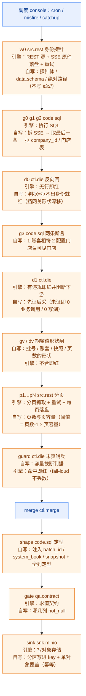
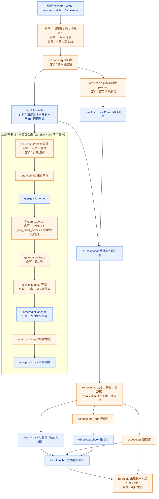

# 乐檬（lemeng）采集管线流程图

> **这是「源系统 = 乐檬」的图。** 两个账套（3120 / 64188）**共用同一批管线** —— 客户差异只在
> `env`（账户号 / 门店清单 / 桶）· 保存的连接 · 每账套一份的排班文件 ⇒ **下面两张图对两个账套都成立**，
> 客户既不进图、也不进文件名。
> **图例与通用表**（🟦 引擎替我们干的 / 🟧 语义由我们写）在 [`README.md`](README.md)；
> **形态与选型的正典**在 `docs/data-platform-handbook.md` §1.1.7；**乐檬特有的方言**在各管线自己的
> `_note` 与 handbook §1.6 案例库。**本文件不复制正文。**
> **维护约定**：改了乐檬任何管线的节点/边 ⇒ 改本图，并重跑 `pnpm exec tsx scripts/lemeng/data-plane-lock.mjs`。

## 乐檬的三形态 × 8 条管线

| 形态 | 文件 | 份数 |
|---|---|---|
| **L0 直连**（单窗/日频，无跨窗编排） | `lemeng.dim.branch.l0.json` · `lemeng.dim.item.l0.json` | 各 1（双账套） |
| **L1 编排**（跨窗循环） | `lemeng.retail.windows.l1.json` · `lemeng.retail.tick.l1.json` · `lemeng.retail.close.l1.json` | 3 |
| **业务子管线**（单窗怎么采，被 L1 复用） | `lemeng.retail_order_line.window.json` · `lemeng.retail_order_line.tick.json` | 2 |
| **回填变体**（只差窗口来源，不进调度） | `lemeng.retail.windows.backfill.json` | 1 |

---

## 图 1 · L0 直连（维度面：全量快照）

> `item.l0` 同形，差别只有：分页到 **150 页**、`shape` 多一步「摊平 3 对象」。

---

## 图 2 · L1 编排（零售跨窗）+ 被它复用的业务子管线

**三兄弟的差别只在窗口表**：`windows` = 24 窗（日批，零点在 UTC 02:30 / 10:30 双点火）；
`tick` = 当前小时 + 前一小时（每 5 分钟，`misfire:skip`，catchup 结构上补不回错过的窗）；
`close` = 仅前一小时（1 窗）。`backfill` 变体与 `windows` 同形，**只差窗口来源是参数**（`BIZDAY`），且**不含 `op`/`wh`**（手动驱动、不进调度）。

---

---

## 还必须自己写的（引擎给不了的业务语义）

| 自写件 | 解决什么问题 |
|---|---|
| 身份门 4 条 SQL + 2 条判据 | **凭据与账套是否相符** —— 防越权采错账套 |
| 窗口表 SQL（3 形） | 该采哪些窗（24 / cur+prev / prev） |
| 定型 SQL（注入 batch_id / system_book / snapshot + 列类型） | **落湖即定型** —— 防「列全是字符串」「同表两种时间格式」 |
| `qa.contract` 的 not_null 清单 | 契约 |
| 末页哨兵阈值算式 | 容量截断 **fail-loud**，不静默丢数 |
| 汇总 / 缺口 SQL + 判红文案 | 哪窗缺了、读哪份收据 |
| sink key 与分区形状 | 幂等 + 下游可读 |
| `_ops` 行形状 | 观测面对齐 |

---

## 落到「降工作量」的边界

- **新账套**（同渠道）：换连接 + 换账户号/门店清单 + 复核五点验收 —— **自写件一行不用改**。
- **新渠道**：形态与纪律可照抄，但上表「自写件」那一栏要重写一遍（乐檬特有的方言坑在
  `docs/data-platform-handbook.md` §1.6 案例库里，17 条）。
